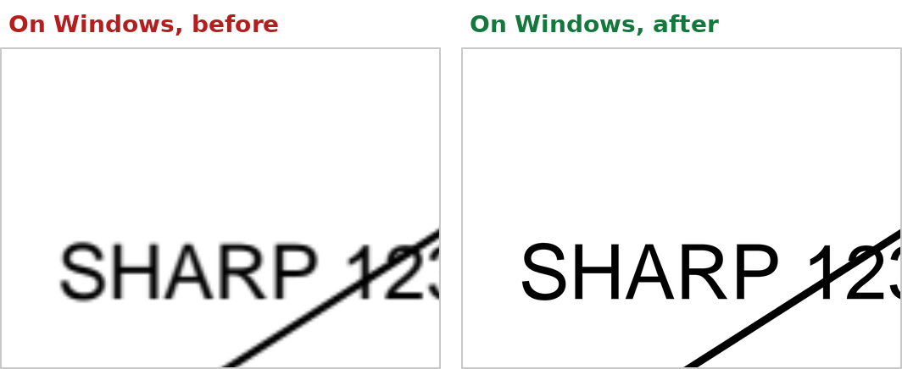

# PPTX MacToWindows Fix

Made your slides on a Mac, and the images look pixelated when the presentation is opened on a Windows PC? This small Mac app fixes that. It creates a copy of your presentation in which those images are sharp on Windows too.



## Is this for me?

Yes, if you:

- make presentations in **PowerPoint for Mac**,
- **copy and paste** parts of PDF files into your slides (figures from articles, tables, charts), and
- see those images turn **blurry or pixelated** when the presentation is shown on **Windows** (for example on a conference or classroom PC), while they look perfect on your Mac.

## Why this happens

When you paste a piece of a PDF into PowerPoint for Mac, PowerPoint saves two versions of it in the file: the original PDF, which is sharp at any size, and a small backup picture of only a few hundred pixels wide. Your Mac shows the sharp PDF. Windows cannot read that PDF, so it shows the small backup picture, enlarged to fit the slide. That is the pixelation you see.

This app takes the sharp PDF that is already inside your file and turns it into a high-resolution picture (300 ppi at the size it appears on your slide) that Windows can show. Your presentations never leave your Mac: all the work happens locally. The only time the app goes online is a daily check for new versions (see Updates below).

## Installation

1. Download `PPTX-MacToWindows-Fix-macOS.zip` from the [latest release](../../releases/latest).
2. Double-click the zip to unpack it.
3. Drag **PPTX MacToWindows Fix** to your **Applications** folder and open it.

Requires macOS 13 (Ventura) or later, on Apple silicon or Intel.

## First launch

The app has no window. It lives in the **menu bar** at the top right of your screen, as a **magic wand** icon.

On first launch it asks two things:

- **Open at login**: leave this on if you want automatic fixing to keep working after a restart.
- **Choose a folder** to watch (optional, see below). You can also do this later from the menu.

macOS may also ask whether the app may **send notifications** (recommended, so you know when a file is ready) and whether it may access folders such as **Documents**, **Desktop** or **OneDrive**. Allow access to the folders where your presentations are.

## How to use it

### Drop files on the icon

Drag one or more presentations onto the magic wand icon in the menu bar. You can also drop a whole folder, or drop files on the app icon in Finder or the Dock. For each presentation that needs it, a fixed copy appears next to the original:

`My talk.pptx` → `My talk_windows.pptx`

You get one notification per drop, also when you drop many files at once. Click it to show the new file in Finder.

You can also choose **Fix Presentation…** in the menu to pick files.

### Let it work automatically

Choose **Choose Folder to Fix Automatically…** in the menu and pick the folder where you keep your presentations (subfolders are included). From then on:

- every presentation you save or copy into that folder gets a `_windows` version next to it within a few seconds, and
- when you change the original later, the `_windows` version is updated automatically.

### Which file do I use?

Keep working in your **original** file on your Mac. Use (or send) the **`_windows`** file when the presentation will be shown on Windows. It also works fine on a Mac.

## Good to know

- **Your original is never changed.** The app only writes the `_windows` copy.
- **Only the affected images change.** Pasted PDF clips are replaced by sharp pictures in the same position, size and cropping. Text, layout, animations, notes and all other images stay exactly as they are.
- **"Nothing to fix"** means the presentation has no images of this type, so it will already look the same on Windows. No copy is made in that case.
- **The copy is usually a bit larger.** In the original, the sharp version is a PDF, which stores text and lines very compactly. Windows needs a picture instead, and a sharp picture stores millions of pixels. In practice the difference is small (for example 9.6 MB → 10.4 MB).
- The fixed images are pictures, not PDFs, so in the `_windows` file you cannot extract them back as PDF. Edit the original instead.

## Troubleshooting

**I don't see the icon in the menu bar.** On MacBooks with a notch, menu bar icons can be hidden when the menu bar is full. Close a few other menu bar apps, or drop your files on the app icon in Finder instead. Opening the app again from Applications shows a window with the main options.

**I don't get notifications.** Check System Settings > Notifications > PPTX MacToWindows Fix. Without notifications, the app shows a message window when you drop files yourself.

**The watched folder does nothing.** Make sure the app is running (icon in the menu bar) and that it was allowed to access that folder (System Settings > Privacy & Security > Files and Folders). Files whose name ends in `_windows` are skipped on purpose.

**An image is still blurry on Windows.** The app fixes images that were pasted from a PDF. A screenshot or photo that was already low-resolution cannot be made sharper. Images pasted from other Mac apps than a PDF viewer have not been tested.

## Updates

Once a day the app checks GitHub for a new version. It only reads the public release page; nothing about you or your files is sent. When a new version is available, you get a notification and an **Update Available** item appears at the top of the menu. From there you can see what's new and choose **Download**, **Later** or **Skip This Version**.

To install an update: quit the app, unzip the download and replace the app in Applications.

You can also choose **Check for Updates…** in the menu at any time, or turn off **Check for Updates Automatically**.

## Support

The app is free. If it saves you time, you can [buy me a coffee](https://buymeacoffee.com/filiphaegdorens). You can also find the link in the app menu.

## Uninstalling

Choose **Quit** in the menu, turn off **Open at Login** first if it was on, and move the app from Applications to the Trash.

## For developers

The app is written in Swift with only Apple frameworks, no external libraries. Requires Xcode or the Command Line Tools.

```
./build_app.sh
tests/run_tests.sh      # needs: pip install python-pptx pillow
```

Command line use: `"PPTX MacToWindows Fix.app/Contents/MacOS/PPTXFix" --fix in.pptx [out.pptx]`, or `--fix-all a.pptx b.pptx ...`

| File | Contents |
|---|---|
| `Sources/Zip.swift` | Reading and writing the .pptx (ZIP) container |
| `Sources/EMF.swift` | Extracting the PDF that PowerPoint for Mac stores inside an EMF image |
| `Sources/Render.swift` | Rendering the PDF to PNG with Core Graphics |
| `Sources/Fixer.swift` | Replacing the images and checking the result |
| `Sources/main.swift` | Menu bar app: drag and drop, watched folder, notifications |
| `tests/` | Builds test presentations and checks the output |
