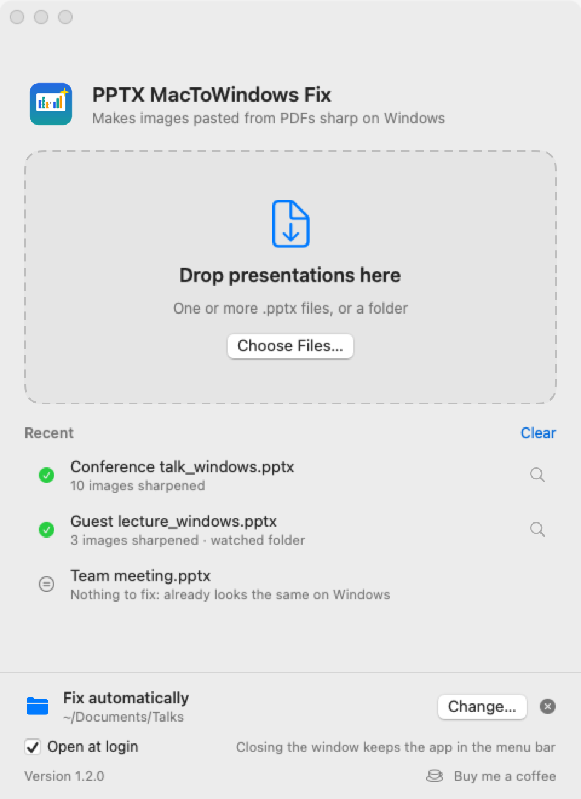

# PPTX MacToWindows Fix

Made your slides on a Mac, and the images look pixelated when the presentation is opened on a Windows PC? This small Mac app fixes that. It creates a copy of your presentation in which those images are sharp on Windows too.


## Is this for me?

Yes, if you:

- make presentations in **PowerPoint for Mac**,
- **copy and paste** parts of PDF files into your slides (figures from articles, tables, charts), and
- see those images turn **blurry or pixelated** when the presentation is shown on **Windows** (for example on a conference or classroom PC), while they look perfect on your Mac.

## Why this happens

When you paste a piece of a PDF into PowerPoint for Mac, PowerPoint saves two versions of it in the file: the original PDF, which is sharp at any size, and a small backup picture of only a few hundred pixels wide. Your Mac shows the sharp PDF. Windows cannot read that PDF, so it shows the small backup picture, enlarged to fit the slide. That is the pixelation you see.

This app takes the sharp PDF that is already inside your file and turns it into a high-resolution picture (300 ppi at the size it appears on your slide) that Windows can show. Your presentations never leave your Mac: all the work happens locally. The only time the app goes online is a daily check for new versions (see [Updates](#updates)).

## Installation

1. Download `PPTX-MacToWindows-Fix-macOS.zip` from the [latest release](../../releases/latest).
2. Double-click the zip to unpack it.
3. Drag **PPTX MacToWindows Fix** to your **Applications** folder and open it.

That's all: the app is complete, and you don't need to install anything else. It is signed and notarized by Apple. The first time, macOS asks whether you want to open an app downloaded from the internet: click **Open**.

Requires macOS 13 (Ventura) or later, on Apple silicon or Intel.

## First launch

A welcome screen explains the three ways to use the app. Leave **Open at login** on if you want automatic fixing to keep working after a restart, and click **Get Started**.

macOS may then ask whether the app may **send notifications** (recommended, so you know when a file is ready while the window is closed) and, later, whether it may access folders such as **Documents**, **Desktop** or **OneDrive**. Allow access to the folders where your presentations are.

## How to use it



### Drop presentations in the window

Drag one or more presentations, or a whole folder, anywhere onto the window. You can also click **Choose Files…**, or drop files on the app's icon in the Dock or in Finder. For each presentation that needs it, a fixed copy appears next to the original:

`My talk.pptx` → `My talk_windows.pptx`

The window shows the progress and, under **Recent**, the result for each file. From that list you can:

- **drag a fixed copy** straight into an email, Teams or a Finder folder,
- **double-click** it to open it,
- click the **magnifying glass** to show it in Finder (right-click for more options).

### Let it work automatically

At the bottom of the window, next to **Fix automatically**, click **Choose Folder…** and pick the folder where you keep your presentations (subfolders are included). From then on:

- every presentation you save or copy into that folder gets a `_windows` copy next to it within a few seconds, and
- when you change the original later, the `_windows` copy is updated automatically.

This keeps working while the window is closed. You get a notification when new copies are ready.

### Closing the window

Closing the window does not quit the app. It keeps running in the **menu bar** at the top right of your screen, as a **magic wand** icon, so the watched folder keeps working. Click that icon and choose **Open PPTX MacToWindows Fix** to bring the window back, or simply open the app again from Applications. To quit completely, choose **Quit** in that menu.

When the app starts at login, it starts quietly in the menu bar without opening the window.

### Which file do I use?

Keep working in your **original** file on your Mac. Use (or send) the **`_windows`** file when the presentation will be shown on Windows. It also works fine on a Mac.

## Good to know

- **Your original is never changed.** The app only writes the `_windows` copy.
- **Only the affected images change.** Pasted PDF clips are replaced by sharp pictures in the same position, size and cropping. Text, layout, animations, notes and all other images stay exactly as they are.
- **"Nothing to fix"** means the presentation has no images of this type, so it will already look the same on Windows. No copy is made in that case.
- **The copy is usually a bit larger.** In the original, the sharp version is a PDF, which stores text and lines very compactly. Windows needs a picture instead, and a sharp picture stores millions of pixels. In practice the difference is small (for example 9.6 MB → 10.4 MB).
- The fixed images are pictures, not PDFs, so in the `_windows` file you cannot extract them back as PDF. Edit the original instead.

## Troubleshooting

**I closed the window and can't find the app.** Open it again from Applications (or with Spotlight): the window comes back. On MacBooks with a notch, the menu bar icon can be hidden when the menu bar is full.

**I don't get notifications.** Check System Settings > Notifications > PPTX MacToWindows Fix. Notifications are only sent while the window is closed or in the background; everything is always listed in the window as well.

**The watched folder does nothing.** Make sure the app is running (icon in the menu bar) and that it was allowed to access that folder (System Settings > Privacy & Security > Files and Folders). Files whose name ends in `_windows` are skipped on purpose.

**"Only PowerPoint presentations (.pptx) can be fixed."** The app works on .pptx files. Older .ppt files are not supported; open them in PowerPoint and save them as .pptx first.

**An image is still blurry on Windows.** The app fixes images that were pasted from a PDF. A screenshot or photo that was already low-resolution cannot be made sharper. Images pasted from other Mac apps than a PDF viewer have not been tested.

## Updates

Once a day the app checks GitHub for a new version. It only reads the public release page; nothing about you or your files is sent. When a new version is available, a banner appears at the top of the window (and you get a notification if the window is closed). From there you can see what's new and choose **Download**, **Later** or **Skip This Version**.

To install an update: quit the app (menu bar icon > Quit), unzip the download and replace the app in Applications.

You can also choose **Check for Updates…** in the menu bar icon's menu at any time, or turn off **Check for Updates Automatically** there.

## Support

The app is free. If it saves you time, you can [buy me a coffee](https://buymeacoffee.com/filiphaegdorens). The link is also at the bottom of the app window.

## Uninstalling

Uncheck **Open at login** at the bottom of the window, choose **Quit** in the menu bar icon's menu, and move the app from Applications to the Trash.

## Building from source (developers only)

You don't need this to use the app. It is only for people who want to change or build the app themselves.

The app is written in Swift and uses only Apple's own frameworks, without external libraries. Building it requires Xcode or the Xcode Command Line Tools.

```
./build_app.sh
tests/run_tests.sh      # needs: pip install python-pptx pillow
```

Command line use: `"PPTX MacToWindows Fix.app/Contents/MacOS/PPTXFix" --fix in.pptx [out.pptx]`, or `--fix-all a.pptx b.pptx ...`

| File | Contents |
|---|---|
| `Sources/Zip.swift` | Reading and writing the .pptx (ZIP) container |
| `Sources/EMF.swift` | Extracting the PDF that PowerPoint for Mac stores inside an EMF image |
| `Sources/Render.swift` | Rendering the PDF to PNG with Core Graphics |
| `Sources/Fixer.swift` | Replacing the images and checking the result |
| `Sources/Updater.swift` | Checking GitHub for a new version |
| `Sources/Model.swift`, `Sources/Views.swift` | The window and the welcome screen (SwiftUI) |
| `Sources/main.swift` | App logic: window, menu bar, watched folder, notifications, command line |
| `Sources/Snapshots.swift` | Screenshots of the window for the tests |
| `tests/` | Builds test presentations, checks the output and the app's behaviour |
